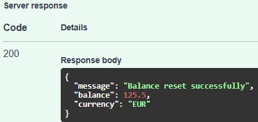

|ID|Title|Priority|Risk Rationale|Steps|Expected Results|
|---|---|---| --- | --- | --- |
|1|UI review|Med|High impact on user satisfaction|Open test app web page|Check that all necessary UI elements are present and match the design (place, size, color)|
|2|Testing the match list|High|Covers GET All matches API and correct display of data on the UI |Check match list|1. Match list contains only upcoming football matches. 2. Each match shows: home team vs away team; kickoff date/time label; three selectable odds buttons: 1,X,2. 3. For any match check that displayed data corresponds with data returned by "matches" request in Dev tool. 4. The list is sorted in ascending date order|
|3|Testing the balance|High|Covers GET Current balance API and correct display of data on the UI|Check user's balance|1. Balance is in EUR. 2. The value matches what was returned by "balance" request in Dev tool.|
|4|Match selection|Med|Checking the correctness of the match selection for betting|1. Press one of the buttons 1,X,2 for any match. 2. Select an another button for the match. 3. Remove selection by pressing "x".|1. Bet Slip shows active selection (match, winner, odds), Stake (0.00), available balance, Potential Payout, including: "Place Bet" (disabled), Remove all, per-selection remove (x). 2. Selecting a new odds button replaces the previous selection. 3. The selection is removed, Bet Slip is empty.|
|5|Stake validation|Med|Checking the correctness of the Stake input field validation|1. Select any odds button for any match. Enter 0.99 in Stake field. 2. Enter 100.01 in Stake field. 3. Reduce the user's balance below 100 EUR and enter 100 in Stake field. 4. Enter stake without decimal/with 1 decimal/with 2 decimal places. |1. There is an error "Minimum stake is €1.00". "Place Bet" button is disabled. 2. There is an error "Maximum stake is €100.00". "Place Bet" button is disabled. 3. There is an error "Insufficient balance". "Place Bet" button is disabled. 4. Stake is applied, "Place Bet" button is available.|
|6|Place a bet|Crit|Testing the main flow and covering Place a bet API|1. Make a selection, enter a stake within user's balance. 2. Press "Place Bet" button. 3. Check modal. 4. Close the modal.|1. Bet slip shows the total stake and potential payout. "Place Bet" button is unblocked. 2. "Place Bet" button is in loading state "Placing...". After that the bet placed, success receipt modal appears. 3. Modal contains: title "Bet Placed Successfully!", Bet ID, Match details, Selection, Stake, Odds at placement, Potential payout, Placement timestamp, Close button. 4. User returns to the main screen without active selection. The balance has decreased by the bet amount.|
|7|Testing the filters|Low|Improve the usability of the interface. Inoperative filters reduce user satisfaction and complicate the process of finding the right match.|1. Select date range. 2. Select odds range. 3. Check the counter of displayed matches.|1. Check that match list shows matches from the selected date range (inclusive). 2. Check that match list shows matches from the selected odds range (inclusive). 3. The counter of displayed matches shows match count accoring to applied filter.|
|8|Reset user's balance|Med|Checking endpoint functionality|1. Perform Reset balance API. 2. Perform Get balance API.|Request performed successfully and returned 200 OK with payload:   2. Request performed successfully and returned 200 OK with default balance after resetting.|

I tried to cover all the APIs and the most important UI elements in such a small number of tests.
I combined interface and API checks where possible, and added a separate check for the remaining API.

Out of testing (due to lower priority):
1. Detailed API testing
2. Negative case
3. Detailed filter's testing
