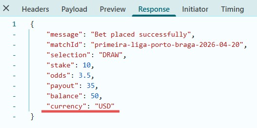
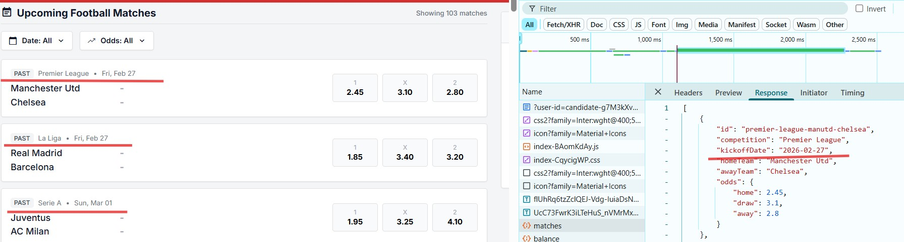
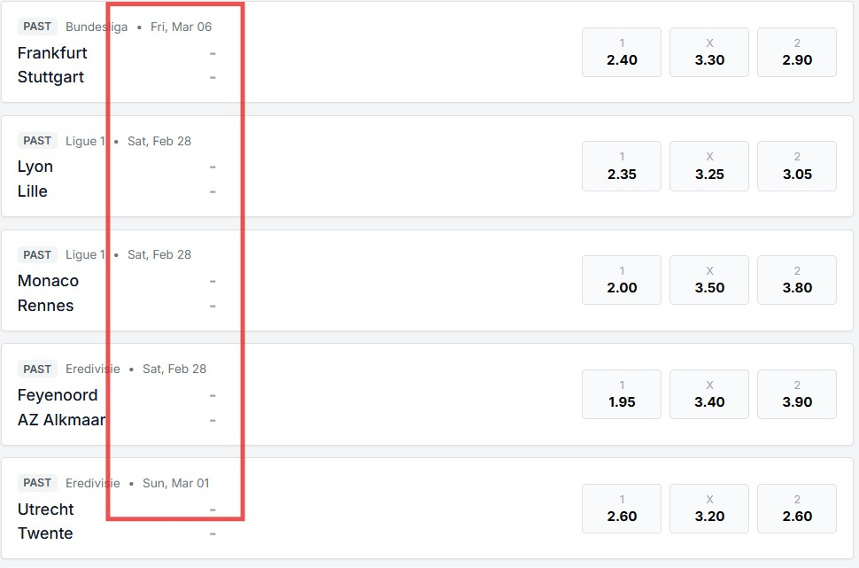

|Bug ID|Title|Severity|Reproduction Steps|Expected vs Actual result|Business Impact|Evidence|Test ID|
| ---: | --- | --- | --- | --- | --- | --- | --- |
|1|Modal window displays incorrect bet details|Crit|1. Make a selection, enter a stake within user's balance. 2. Press "Place Bet" button. 3. Check modal and compare it with Place a bet API response.|3. Modal contains:  * Title "Bet Placed Successfully!" - **PASS**,  * Bet ID - **PASS**,  * Match details - **FAIL: the teams are mixed up in the matchId, kick-off date is not displayed**,  * Selection - **FAIL: selection is not displayed**,  * Stake - **PASS**,  * Odds at placement - **PASS**,  * Potential payout - **FAIL: incorrect value of Potential payout**,  * Placement timestamp - **PASS**,  * Close button - **PASS**. |Incorrect data about bets placed misleads users, increases the number of support requests, and negatively impacts the product's rating.|  |6|
|2|Incorrect timestamp on modal window|Low|1. Make a selection, enter stake and press "Place Bet" button. 2. Check timestamp on the Success Receipt|1. Success Receipt is displayed. 2. Betting timestamp has format "current_date time" - **FAIL: Betting timestamp is shown like "Today, 06:51 PM"** |It is more clear for user to use "current date/time" instead of "today".||6|
|3|User's balance is not updated after betting without refresh the page.|Med|1. Place a bet. 2. Close the Success Receipt and check user's balance.|2. The user's balance decreases by the staked amount - **FAIL: user's balance is not changed**. It is necessary to refresh the page to update the balance.|User inconvenience. Backend load increases due to additional requests.|Place a bet API returns updated balance to the UI: |6|
|4|Place a bet API returns incorrect currency|Low|Place a bet and check place-bet response in Dev tool.|place-bet response shows "currency": "EUR" - **FAIL: response shows "currency": "USD"**|Probably the system stores incorrect currency.||6|
|5|Match list contains past and current matches|High|Open test app web page|Match list contains only upcoming football matches - **FAIL: the match list contains past and current matches.** GET all matches API returns this incorrect list.|This allows the user to bet on past matches, which violates the main business scenario.|Match list in UI and API response: |2|
|6|Match list should be sorted by date|Med|Open test app web page|Matches are sorted by ascending date - **FAIL: the matches are not sorted correctly**|It's inconvenient to search for the desired match in the list.|Matches are sorted incorrectly:  |2|
|7||||||||
|8||||||||
|9||||||||
|6||||||||
